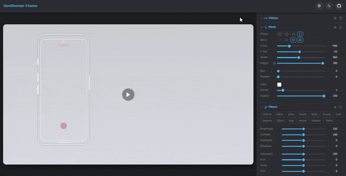

# Gentleman Frame

いわゆる紳士枠を表示するツール

**<https://gentleman-frame.pages.dev/>**

---

## 機能

### 動画

- **2レイヤー構成**：背景と前景を重ねて表示
- MP4・画像をドロップまたは URL 入力で読み込み。iwara.tv の URL にも対応
- 2本の動画の再生位置をオフセット値に合わせて**自動補正**。オフセットスライダーで任意の時間差を設定可能
- 背景・前景の**入れ替え**、表示/非表示、音量・ミュート調整

### マスク

- 前景動画に重ねる切り抜きエリアを**ドラッグ**で移動・リサイズ
- 形状：**四角 / 円 / ハート**
- ぼかし・ピクセル化・カラー枠線（虹・シアンマゼンタ・桜など**アニメーション**あり）
- **マウス追従モード**でリアルタイムにマスクを動かせる
- マスクホバー中にホイールでサイズ変更

### フィルター（映像全体）

| カテゴリ | 効果 |
| --- | --- |
| 基本補正 | 明るさ・コントラスト・彩度 |
| トーン | ハイライト・シャドウ |
| 特殊 | 色収差・シャープネス |
| 雰囲気 | ビネット・フィルム粒子 |

### プリセット

- 設定を名前付きで**保存・呼び出し**
- フォルダで整理
- **共有コード**（短縮テキスト）または **JSON ファイル**でエクスポート／インポート

> [!WARNING]
> プリセットはブラウザの **localStorage** に保存されています。
> ブラウザのキャッシュ・サイトデータをクリアすると**すべて消えます**。
> 大切なプリセットは定期的にプリセットパネル右上の **↓ ボタン（JSON 保存）** でバックアップしてください。

---

## 使い方

習うより慣れよー。

### キーボード

| キー | 動作 |
| --- | --- |
| `Space` | 再生 / 一時停止 |
| `←` / `→` | 1 秒シーク |
| `Shift` + `←` / `→` | 5 秒シーク |

### マウス（キャンバス上）

| 操作 | 動作 |
| --- | --- |
| 右クリック | マスク追従モード ON / OFF |
| ホイール（追従中 or マスクホバー中） | マスクサイズ変更 |
| ホイールクリック（中ボタン） | 背景・前景入れ替え |
| ダブルクリック | フルスクリーン切替 |

---

## プライバシー

iwara の URL を入力した場合、動画解決リクエストは [Cloudflare Workers](https://workers.cloudflare.com/) 経由で処理されます。  
Cloudflare のインフラは送信元 IP アドレスおよびアクセス日時を記録することがあります（[Cloudflare プライバシーポリシー](https://www.cloudflare.com/privacypolicy/)）。  
このツール自体がユーザーの個人情報を収集・保存することはありません。

---

## 免責事項

- 本ツールは個人利用を目的として提供されています
- 各動画サービスの利用規約はユーザー自身が確認・遵守してください
- 本ツールの使用により生じたいかなる損害についても、開発者は一切の責任を負いません
- 予告なく機能変更・公開停止する場合があります

---

## デモ素材クレジット

デモ GIF に以下の 3D モデル作品を使用しています。

| 作品 | 作者 |
| --- | --- |
| [秤アツコ（ブルアカ）](https://3d.nicovideo.jp/works/td88695) | ちくわエグゼ ([@chikuwa_exe](https://x.com/chikuwa_exe)) |
| [秤アツコ(ブルーアーカイブ)水着](https://3d.nicovideo.jp/works/td95433) | ちくわエグゼ ([@chikuwa_exe](https://x.com/chikuwa_exe)) |

ライセンス：著作表示・非商用・改変可・再配布時URL表示

---

## License

[MIT](LICENSE)

---

## バグ報告・機能要望

[GitHub Issues](https://github.com/E-DEN/gentleman-frame/issues/new/choose) からお願いします。
